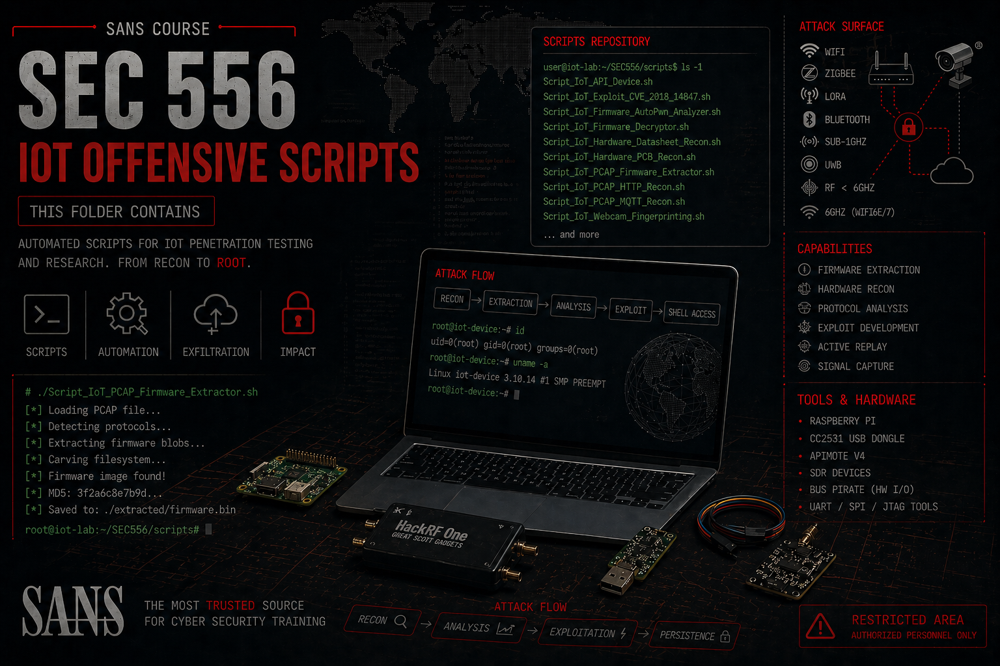

# ***📜  SEC-556 IoT Penetration Testing Scripts***

	

This folder contains a collection of scripts I developed while preparing for the SANS SEC-556: IoT Penetration Testing course.

Rather than approaching the training passively, I spent the days prior to the course working on my own pre-lab challenges, building small tools to better understand common IoT assessment workflows, such as network discovery, protocol analysis, and device interaction.

These scripts reflect that preparation phase.
