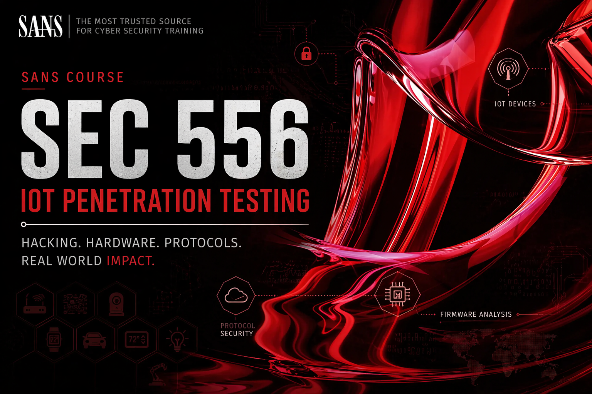

# ***🌘 SANS Course: SEC-556 IoT Penetration Testing***

	

Around April 2026, in the middle of submitting papers for different conferences and working on vulnerability research and protection bypasses, I was offered the opportunity to take the official SANS course on IoT Penetration Testing.

The reason was mainly my previous experience in this field. In fact, my first CVE ([CVE-2021-27289](https://github.com/TheMalwareGuardian/CVE-2021-27289)) is associated with a vulnerability in Zigbee devices, which is an IoT protocol.

Because of that background, I was given the chance to take the course, and I decided to go for it.

This repository is created to provide a review and some guidance around the course without making any disclosure of its official materials. SANS content (books, official notes, labs, and virtual machines) is protected by copyright, and sharing it would lead to legal issues, so nothing from the official material is included here.

The idea is to share a perspective based on my experience in this field and use that to build a simple guide for anyone starting in IoT security.

In addition to the review itself, this repository will include resources and practice ideas so that anyone interested in the course can build a solid base beforehand and follow the material more easily, especially if they are new to IoT.

---
---
---

## ***📑 Table of Contents***

<ul>
	<li><a href="#review">Review</a>
		

			
📂

			<ul>
				<li><a href="#review_day1">Day 1</a></li>
				<li><a href="#review_day2">Day 2</a></li>
				<li><a href="#review_day3">Day 3</a></li>
				<li><a href="#review_day4_5">Day 4 & 5 (CTF - Core NetWars)</a></li>
			</ul>
		

	</li>
	<li><a href="#kit">Kit</a></li>
	<li><a href="#scripts">Scripts</a></li>
	<li><a href="#prelabs">Pre-Labs</a></li>
	<li><a href="#resources">Resources</a></li>
</ul>

---
---
---

## ***⚔️ Review***

Before getting into the actual review of the SANS course, I want to explain how I approached it, because I think that really changes the experience.

This is a SANS course that doesn't come with an exam or a certification. You attend the three training days and, after that, there's an optional CTF you're invited to, but it's not strictly tied to the course itself, it's more general. Beyond that, there's nothing else. So the way you approach it really matters.

In my case, what I did was prepare in advance. During the days before the course, especially the weekend before it started, I went through all the course books. Each day has its own book, so I basically read all the theory beforehand.

That gave me a big advantage during the actual training days. Instead of having to split my attention between theory and practice, I could focus only on what really mattered in the moment. I would pay attention during key explanations, especially when the instructor was sharing experience or when something wasn't entirely clear to me, but apart from that, I spent most of the time doing labs.

And that's where I put most of my effort. I focused on completing the labs for each day and, more importantly, just messing around with all the IoT and hardware hacking devices they give you. Trying things, breaking things, interacting with the hardware, extracting stuff, testing ideas... just really getting hands-on with everything.

Since I had already gone through the theory, I didn't need to revisit it during the course. Most of it was already familiar to me anyway, except for a few interesting details, so I could fully focus on the practical side.

Before going into what each day looked like, you can check the course syllabus yourself [here](https://www.sans.org/cyber-security-courses/iot-penetration-testing#syllabus). It's clearly divided into three days. The first one is more about the basics, introduction to IoT, packet capture analysis, scanning, and initial exploitation. The second day is much more focused on hardware hacking, using the full kit they provide, firmware extraction, analysis, and a lot of hands-on labs, including optional ones. And the third day is centered around technologies like Wi-Fi, Bluetooth, ZigBee, LoRa and SDR, and how to actually attack them.

Overall, it's a very complete course. And for me, it was also a way to disconnect a bit from what I usually do, which is much more focused on exploitation, bypasses, Secure Boot, UEFI, kernel stuff, and spend a few days just playing with IoT again, like going back to that phase where I was more into hardware. I really enjoyed that part.

Honestly, I'd say it's probably one of the most complete courses out there when it comes to IoT, hardware hacking and SDR, because it touches everything and, more importantly, lets you actually work with it.

---

### ***📡 Day 1***

As I mentioned before, Day 1 is mainly focused on introducing IoT security. The full syllabus is available on the official website, so anyone can check the exact contents there, but broadly speaking, this first day is about getting into the foundations of IoT security.

In my case, as I already explained, I focused mostly on the labs and on anything around them that could lead me to investigate real IoT CVEs, vulnerabilities, and related research during those days.

Some of the exercises included packet capture analysis, scanning and exploiting routers, accessing webcams and other IoT devices exposed on the internet, and using APIs to control IoT devices.

That last lab, the one related to APIs and IoT device control, immediately reminded me of DEF CON 33. I was there giving my own talk, but I also spent time reviewing, following, and watching many other talks from friends and people who were also presenting there, both on the Main Stage and in different Villages (Car Hacking, Red Team, etc).

One of those talks came back to my mind when I saw that lab. It was about an electric car brand, where the researcher analyzed the API requests that were allowed by the platform and managed to take ownership of a friend's car. In the talk, you could actually see how the car appeared inside his own account, and once it was there, he could unlock it and interact with it remotely.

So, when I saw that final lab from Day 1, I immediately remembered that talk.

Overall, if I had to rate the first day, keeping in mind that I am already familiar with IoT and looking at it from the perspective of someone who knows the area but is also evaluating the course as training material, I would give it a very solid 8.5. Maybe even a 9.

As course material, and as the first day of the training, I think it is a very strong start. Honestly, the course begins very, very well.

---

### ***🔧 Day 2***

If I had to summarize Day 2 with a single title, it would clearly be hardware hacking.

With the course, you are given a full kit of devices, tools specifically meant for hardware hacking across different technologies. You get devices to work with ZigBee, Bluetooth, Wi-Fi... tools for firmware extraction like the Bus Pirate, devices for replay attacks, and also SDR-related tools like the HackerRF One, which can transmit up to several GHz.

So you are not just looking at IoT from a high-level perspective anymore. You are actually working with what hardware hacking really means: analyzing devices, analyzing PCBs, understanding how those boards are built, extracting the firmware that runs on them, and then analyzing that firmware.

That's why, if I had to define this day, it would be hardware hacking without a doubt. You really start using the full kit, and there is a strong focus on firmware extraction and firmware analysis. There's also a lot of important theory around different interfaces and techniques used for this kind of work, which is key if you want to go deeper into IoT security.

The labs are very good and heavily focused on firmware. There are even optional labs if you want to go further, which is something I really liked.

I think this is an area you absolutely need to get into if you want to reach a more advanced level in IoT security. Being able to extract firmware, analyze it, understand how devices are built internally... that's where things start to get really interesting.

At the same time, it's also a day that can feel overwhelming if you haven't seen this before. There's a lot going on, and the concepts are not trivial. That's why I would definitely recommend the same approach I followed: go through the theory beforehand, so that during the actual training you can focus entirely on the labs.

In my case, since I had already covered the theory, I spent most of the time doing labs, looking for additional resources that I found interesting, and exploring how to use the tools properly. It also gave me a lot of ideas for future projects, which for me is always a good sign.

It was a very intense day, very focused, and I basically dedicated all my time to labs, external resources, and thinking about how to build on top of what I was learning. And honestly, it's really, really good.

If I had to give it a score, I'd say around an 9. The knowledge you get here is quite different from Day 1. It's much more hardware-oriented, much more about reading PCBs, understanding interfaces, knowing how to extract and analyze firmware. And it's definitely not basic anymore, I'd say it sits more at an intermediate level.

---

### ***📶 Day 3***

I'm not even sure how to properly start this one, but if I had to describe Day 3 in a simple way, I'd call it "signal".

Day 1 was more about the introduction and how to approach real testing. Day 2 was clearly hardware. And Day 3 is about the signal layer, protocols, communications, how devices actually talk to each other.

So here you're dealing with things like Wi-Fi, Bluetooth, ZigBee, LoRa, SDR... and you start using the rest of the kit much more intensively. And the kit itself is actually quite impressive. It's not just a couple of devices, it's a full set of tools that, if you look at it, is easily worth more than $600 today.

And even for the things that are not included, the course material is full of references, so you know exactly what to buy and where to get it, usually at a reasonable cost.

The labs in this last day revolve around all of that. You're using the devices, interacting with signals, working at the protocol level. It's similar in spirit to what you've already seen before, but now applied to communication layers. Things like replay attacks, attacking protocols to capture keys, interacting with wireless communications... that kind of work.

And I think the way the course ends is actually very well done.

If I had to rate this day, I'd again give it something like an 8.5. In the end, this is an introductory course, but it gives you absolutely everything. It gives you the material, the labs, the ideas, the projects, real-world cases... it really gives you a full picture.

And on this last day, it kind of brings everything together. You've seen the basics, you've worked with hardware, and now you're working with signals and protocols. At that point, you start thinking more about what you want to do next.

You start thinking: okay, now I want to take one of these real-world cases, one of these CVEs or attacks I've seen, and try to reproduce it myself. I want to get the same device, follow the same path as the original researcher, and build something on top of it.

That's really the mindset you leave the course with. You now have the devices, you have the knowledge, you know what you need to buy if you want to go deeper, and you know how to approach these problems.

And that's why, despite having no affiliation with SANS, I would strongly recommend this course, as I genuinely believe that, while it's marketed as an IoT penetration testing course, it actually provides a comprehensive introduction to IoT, OT, network, and hardware. It covers hardware hacking, wireless hacking, and the security side of it all.

It brings everything together in just three days, with real cases, actual devices, and hands-on experience.

And after that, even if you've completed all the labs like I did, if you're curious, you're not done. You actually end up with a lot of ideas. You start thinking about real cases you want to reproduce, devices you want to get, projects you want to build, things you want to test yourself.

So in the end, you don't just finish the course, you leave with everything you need to keep going.

---

### ***🏁 Day 4 & 5 (CTF - Core NetWars)***

Unlike other SANS courses that run for five full days, SEC-556 is a three-day course. So technically, there is no "Day 4" or "Day 5" in terms of training content.

However, SANS usually complements the course with an optional CTF experience, which is where these extra days come into play.

Once you have access to a SANS course, you're typically invited to participate in a [NetWars](https://www.sans.org/cyber-ranges#netwars)-style CTF, which runs separately from the training itself. This usually takes place in specific time slots after the course hours. For example, if the course runs from 10:00 to 18:30, the CTF might take place later in the evening, something like 19:30 to 22:30.

This CTF is shared with other participants, and it's designed as a more general, multidisciplinary challenge, not strictly limited to IoT. It covers a wide range of topics and is meant to test your ability to think, adapt, and solve problems under time pressure.

In my case, these "Day 4 and 5" were entirely focused on that experience.

That said, there is quite a lot to unpack when it comes to how the CTF works, how I approached it, the strategy behind it, and what you actually need if you're planning to take part in it.

Because of that, instead of trying to compress everything into this section, I created a separate repository dedicated entirely to the NetWars experience:

👉 [SANS Core NetWars Tournament & Skills Quest by NetWars](https://github.com/TheMalwareGuardian/SANS-Core-NetWars-and-Skills-Quest)

There, I go into detail about the approach, challenge types, final ranking, lessons learned, and how to properly prepare if you want to get the most out of it.

---
---
---

## ***🔩 Kit***

One of the biggest advantages of this course is the hardware kit they give you. It is not just a couple of devices, it is a full set of tools that, if you look at it, is easily worth more than $600 today.

Since that is a key part of the experience and something not many people talk about when reviewing this course, I decided to document it properly. Every device, every tool, photos of the full kit, so you actually know what you are getting before you sign up.

All of that is available inside the "[Kit](https://github.com/TheMalwareGuardian/SANS-SEC556-IoT-Penetration-Testing/tree/main/04%20Kit)" folder in this repository.

---
---
---

## ***📜 Scripts***

Alongside the course, I started building a collection of scripts to support the labs and automate different parts of the workflow.

The goal here is not to replicate the official labs, but to extend them. These scripts are meant to help you move faster, understand what's happening under the hood, and experiment beyond what is strictly required during the course.

You can think of this section as a practical layer on top of the course:

- Extracting and analyzing data more efficiently.
- Reusing techniques outside the course environment.
- Automating tasks that are done manually during the labs.
- Interacting with devices and protocols in a more flexible way.

All the scripts are available inside the corresponding "[Scripts](https://github.com/TheMalwareGuardian/SANS-SEC556-IoT-Penetration-Testing/tree/main/03%20Scripts)" folder in this repository, organized by topic.

---
---
---

## ***🧪 Pre-Labs***

After finishing the course, I thought it would be a good idea to include an exercises section.

The goal here is simple. Without disclosing any of the official labs, which obviously can't be shared due to copyright, I wanted to create a small set of exercises that could help build a base before going into each day of the course.

So inside this repository, you'll find a folder called "[Pre-Lab Challenges](https://github.com/TheMalwareGuardian/SANS-SEC556-IoT-Penetration-Testing/tree/main/02%20Pre-Lab%20Challenges)", and within it there are three subfolders: Day 1, Day 2, and Day 3.

Each one contains a simple exercise that, in my opinion, you can complete without needing any of the hardware devices. They are more software-oriented, things you can do with your own setup, your own analysis environment, your own tools.

The idea is that if you go through these exercises before each corresponding day, you'll already have some context and it won't take you as long to get into the labs. You'll have a base, and that makes a big difference when you start working with the actual material.

---
---
---

## ***🛰️ Resources***

Before taking this course, I already had some experience in this area. One of my first professional experiences was an OT security project where I spent almost a year working exclusively in industrial environments.

During that time, in addition to deploying OT honeypots, I was also analyzing and actively testing attacks against multiple industrial and IoT protocols. Because of that, the resources included here are not just random external materials, but things I personally consider useful to better understand IoT and OT security from a more practical, real-world perspective.

With that in mind, this section is designed as a structured extension of the course itself. Instead of being a general collection of IoT resources, everything here is directly mapped to the official SANS SEC-556 syllabus. I took the topics covered during the course and organized external resources around each of them, so you can either follow along more easily or build a base beforehand.

The idea is simple: as you go through each part of the course, you have additional material available, videos, blogs, tools, and real-world cases, that help reinforce what you're learning and give you more context.

All these materials are available inside the "[Awesome Resources](https://github.com/TheMalwareGuardian/SANS-SEC556-IoT-Penetration-Testing/tree/main/01%20Awesome%20Resources)" folder. Inside that folder, there is also a subfolder called "[Bookmarks](https://github.com/TheMalwareGuardian/SANS-SEC556-IoT-Penetration-Testing/tree/main/01%20Awesome%20Resources/Bookmarks)", which contains the same resources exported as HTML bookmark files. You can import those files directly into your browser, making it much easier to access everything in a more comfortable and organized way while preparing for the course or following each topic.

At the end of the day, this section is just meant to make things easier for you. Use it however it works best for you, explore what interests you, and take it as far as you want.

**Note:** You can approach these resources in two ways, either go through them before the course to build a foundation and get familiar with the concepts, or use them alongside the course to deepen your understanding of each specific topic as you progress. If you're new to this field, I would strongly recommend going through them beforehand, there's a lot of content, and it can be difficult to keep up with everything during the course.
